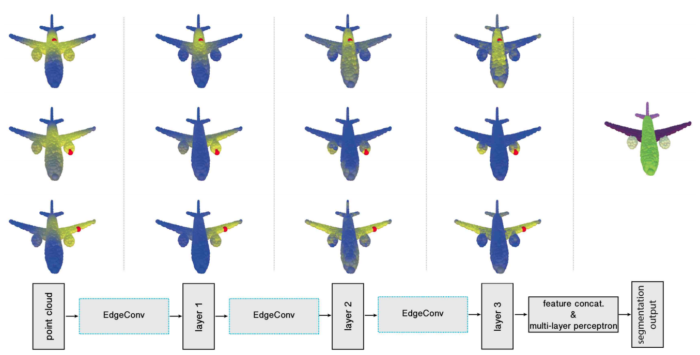

# Dynamic Graph CNN for Learning on Point Clouds
We propose a new neural network module dubbed EdgeConv suitable for CNN-based high-level tasks on point clouds including classification and segmentation. EdgeConv is differentiable and can be plugged into existing architectures.

[[Project]](https://liuziwei7.github.io/projects/DGCNN) [[Paper]](https://arxiv.org/abs/1801.07829)     

## Overview
`DGCNN` is the author's re-implementation of Dynamic Graph CNN, which achieves state-of-the-art performance on point-cloud-related high-level tasks including category classification, semantic segmentation and part segmentation. 



Further information please contact [Yue Wang](https://www.csail.mit.edu/person/yue-wang) and [Yongbin Sun](https://autoid.mit.edu/people-2).

## Requirements
* [TensorFlow](https://www.tensorflow.org/)

## Point Cloud Classification
* Run the training script:
``` bash
python train.py
```
* Run the evaluation script after training finished:
``` bash
python evalutate.py

```

## Citation
Please cite this paper if you want to use it in your work,

	@article{dgcnn,
	  title={Dynamic Graph CNN for Learning on Point Clouds},
	  author={Yue Wang, Yongbin Sun, Ziwei Liu, Sanjay E. Sarma, Michael M. Bronstein, Justin M. Solomon},
	  journal={arXiv preprint arXiv:1801.07829},
	  year={2018}
	}

## License
MIT License

## Acknowledgement
This code is heavily borrowed from [PointNet](https://github.com/charlesq34/pointnet).
